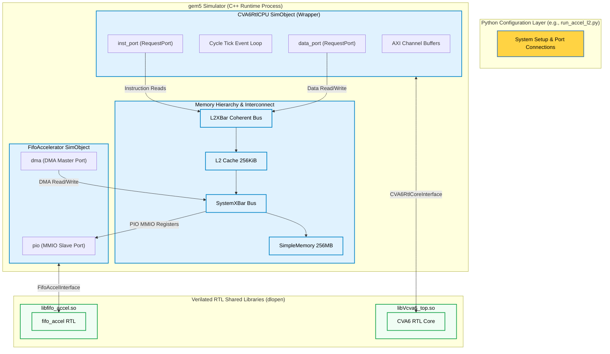

# gem5 & CVA6 RTL Co-Simulation Project Report

This report describes the architecture, operation, and verification flow of the **gem5 & CVA6 RTL Co-Simulation** framework. The environment integrates the RTL description of the OpenHW Group CVA6 (formerly Ariane) RISC-V core with the gem5 system-level simulator. Additionally, it models a custom SystemVerilog FIFO DMA Accelerator connected to the system.

---

## 1. Architectural Overview

The co-simulation framework is organized as a three-tier system:

1. **Python Configuration Layer (`configs/cva6/`)**: Scripts like `run_rtl.py` and `run_accel_l2.py` define the system topology, including clock domains, cache configurations, memory controllers, and bus interconnects.
2. **gem5 C++ Simulator Process (`gem5/src/cpu/cva6/`)**: Standard gem5 SimObjects written in C++ that interface with the Verilated models.
3. **Verilated RTL Shared Libraries (`cva6/` and `accelerator/`)**: The SystemVerilog RTL compiled into shared objects (`.so`) using Verilator. These are dynamically loaded by the gem5 C++ process at runtime via `dlopen`.

### Co-Simulation Topology Block Diagram



---

## 2. Core Components & Implementation

### 2.1 CVA6 RTL Core Submodule (`cva6/`)
The target CPU is the OpenHW Group CVA6 (formerly Ariane), configured by default as a 64-bit RISC-V application core (`rv64imafdc`). The RTL is compiled via Verilator into a C++ model and built as a shared library (`cva6/work-ver-core/libVcva6_top.so`). It exposes standard AXI interfaces for instruction and data memory access.

### 2.2 gem5 `CVA6RtlCPU` SimObject (`gem5/src/cpu/cva6/cva6_rtl_cpu.cc`)
The `CVA6RtlCPU` SimObject acts as the bridge between gem5's transaction-based memory system and the pin-based AXI interface of the Verilated core.

- **Dynamic Loading**: It loads `libVcva6_top.so` at runtime using `dlopen` and resolves `create_core()` and `destroy_core()` factory functions.
- **Ports**: It exposes two gem5 `RequestPort`s: `inst_port` (for instructions) and `data_port` (for data read/writes).
- **Tick Orchestration**: It contains a `tick()` function that executes once per simulated clock cycle (scheduled on `tickEvent`).

### 2.3 Clock Cycle Orchestration Loop
For each simulated clock cycle, `tick()` executes the following sequence:

```
[Sim Cycle Begins]
       │
       ▼
1. Reset Logic ─────────────► Drive rst_ni high/low based on current cycle count
       │
       ▼
2. Falling Edge (clk_i=0) ──► core->eval() propagates inputs combinationally
       │
       ▼
3. Handshake Processing ────► Check AXI handshake conditions (AR, R, B, AW, W)
       │                      If valid requests are pending, map them to gem5 packets
       │                      and dispatch via inst_port/data_port (sendTimingReq)
       ▼
4. Rising Edge (clk_i=1) ───► core->eval() executes RTL state transition
       │
       ▼
5. Intercept Interrupts ────► Check for illegal instructions or 'ebreak' commands
       │                      to terminate simulation
       ▼
6. Re-schedule ─────────────► Schedule next tickEvent at the next clockEdge()
```

---

## 3. AXI Protocol to gem5 Packet Mapping

The co-simulation boundary translates standard AXI4 channels to gem5 timing `Packet`s:

### Read Operations (AR & R Channels)
1. **AR Handshake**: When the core asserts `noc_req_ar_valid_o`, the wrapper checks if it is ready (`!ar_busy` and `!retryPkt`).
2. **Packet Dispatch**: It creates a read packet (`Packet::createRead`) containing the request details (address, size, length) and sends it over `inst_port` (if AXI protection indicates instruction fetch) or `data_port`.
3. **Response Buffer**: When memory replies via `handleTimingResp()`, the data is saved, and `r_data_ready` is set.
4. **R Handshake**: On the falling edge, the wrapper drives `noc_resp_r_valid_i` and the read data `noc_resp_r_data_i`. Once the core asserts `noc_req_r_ready_o`, the beat completes.

### Write Operations (AW, W, & B Channels)
1. **AW & W Handshake**: The wrapper monitors `noc_req_aw_valid_o` and `noc_req_w_valid_o`. It buffers the write address, size, and length.
2. **Packet Dispatch**: For each beat (or upon completion of a write burst), a write packet (`Packet::createWrite`) is sent into gem5.
3. **B Handshake**: Once memory acknowledges the write (`handleTimingResp()`), the wrapper asserts `noc_resp_b_valid_i` and the ID on the B response channel, which the core captures when it asserts `noc_req_b_ready_o`.

---

## 4. FIFO DMA Hardware Accelerator

The project includes a custom SystemVerilog hardware accelerator (`accelerator/fifo_accel.sv`) that is compiled into `libfifo_accel.so` and integrated as a gem5 `FifoAccelerator` SimObject.

### 4.1 Accelerator Registers Map (MMIO Base: `0x10000`)
The host CPU controls the accelerator by reading and writing to its registers:

| Register Name | Offset | Type | Description |
|---|---|---|---|
| **CTRL** | `0x00` | R/W | Bit 0: `start_dma` (Write 1 to trigger)<br>Bit 1: `busy_dma` (Read-only)<br>Bit 2: `done_dma` (Read/Write 1 to clear) |
| **SRC_ADDR** | `0x08` | R/W | 64-bit source memory address in RAM |
| **DST_ADDR** | `0x10` | R/W | 64-bit destination memory address in RAM |
| **LEN** | `0x18` | R/W | 64-bit length of transfer (in 64-bit words) |
| **STATUS/COUNT** | `0x20` | R | Bit 0: `fifo_empty`<br>Bit 1: `fifo_full`<br>Upper bits: Current count of words in the FIFO |
| **FIFO_DATA** | `0x28` | R/W | Read: Pops a 64-bit word from the FIFO<br>Write: Pushes a 64-bit word onto the FIFO |

### 4.2 PIO MMIO Operations
When the CPU performs a read or write to MMIO space (`0x10000` - `0x100FF`):
- The `FifoAccelerator` SimObject intercepts it via `read()` or `write()`.
- It drives the corresponding AXI Slave signals (`s_axi_*`).
- It toggles the Verilated accelerator clock using `stepClock()` until the Slave handshake completes, blocking the CPU memory access until the transaction completes.

### 4.3 DMA Engine (AXI Master Interface)
When DMA is started (`start_dma` written to `CTRL`):
1. **DMA Read**: The accelerator's read engine requests words from the main memory address in `SRC_ADDR` using master AR transactions. The `FifoAccelerator` SimObject intercepts these and performs functional reads from gem5 memory (`dmaPort.sendFunctional`), pushing the retrieved data into the internal circular FIFO.
2. **DMA Write**: The accelerator's write engine pops words from the FIFO and writes them to the main memory address in `DST_ADDR` using master AW & W transactions. The SimObject intercepts these and performs functional writes to gem5 memory (`dmaPort.sendFunctional`).
3. **DMA Done**: When `len` words are written, the engine asserts `done_dma` and clears `busy_dma`.

---

## 5. Verification & Test Execution Flow

Testing is performed using bare-metal assembly programs compiled for target architecture `rv64imafdc`.

### 5.1 Compilation & Assembly
The project provides `setup_toolchain.sh` and `install_toolchain.sh` to download and install a portable RISC-V GCC toolchain. Test cases are compiled into ELF files using the `link.ld` linker script:
- `scratch/sum.S`: Computes a loop sum (1 to 1000) and compares it with `500500`.
- `scratch/test_accel.S`: Configures the DMA registers on the FIFO Accelerator, triggers a DMA transfer of 4 words from `0x80010000` to `0x80020000`, waits for completion by polling `CTRL`, and verifies the data integrity.

### 5.2 Simulation Termination
The simulation termination coordinates with the CPU's bare-metal program:
1. **`tohost` Write**: The assembly tests define a `.tohost` memory section located at `0x80001000`.
2. **Verification Exit**:
   - On success, the software writes `1` to `tohost`.
   - On failure, it writes `3` (or non-zero).
3. **Wrapper Loop Interception**: The Python config run loops poll the memory address `0x80001000` via gem5 `physProxy.read()`. If a non-zero value is detected, the run loop terminates and prints the status.
4. **Hardware Breakpoint (`ebreak`)**: The assembly code calls `ebreak` to trigger a hardware breakpoint. The `CVA6RtlCPU` wrapper detects the assertion of the `ebreak_o` pin and terminates the simulator via `exitSimLoop()`.

---

## 6. Build and Run Commands

The co-simulation workspace provides a Makefile to automate compile and run steps.

### Setup Environment
```bash
# Source the toolchain environment (installs toolchain, verilates core, compiles gem5 if needed)
source setup_toolchain.sh
```

### Build Targets
```bash
make toolchain     # Downloads RISC-V GCC compiler toolchain
make verilate      # Verilates CVA6 RTL using Verilator
make gem5          # Compiles gem5 with CVA6RtlCPU SimObject
make elf           # Compiles bare-metal test programs
make accel-so      # Compiles the FIFO Accelerator verilated shared library
```

### Run Simulations
```bash
# Run bare-metal sum.S on CVA6 RTL Core
make run-rtl

# Run bare-metal sum.S on CVA6 RTL Core with L2 Cache enabled
make run-rtl-l2

# Run FIFO Accelerator test with CVA6 RTL Core
make run-test-accel

# Run FIFO Accelerator test with CVA6 RTL Core and L2 Cache enabled
make run-accel-l2

# Run standard gem5 Timing CPU simulation (No RTL)
make run-gem5
```
