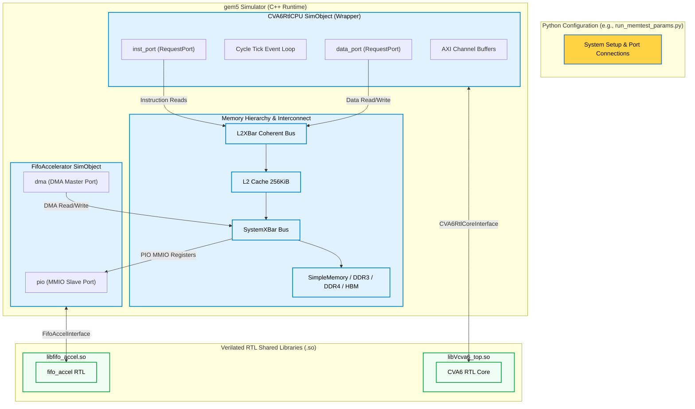

# gem5 & CVA6 RTL Co-Simulation Environment

This repository provides an environment to co-simulate the RTL description of the OpenHW Group **CVA6** (formerly Ariane) RISC-V application core within the **gem5** system-level simulator. Verilator compile-time translation compiles the RTL into shared libraries that are dynamically loaded and orchestrated by custom C++ SimObjects in gem5.

The core scope of this project is to model, simulate, and verify the CPU core's interaction with the rest of the system, enabling testing of:
1. **Memory Distribution and Memory Controllers (Memory Verteilung)**: Compare memory timing statistics across various backends like SimpleMemory, DDR3, DDR4, LPDDR2, and HBM.
2. **Cache Hierarchies**: Evaluate cache configurations, latencies, and bus topologies (e.g., L2 cache coherency via L2XBar).
3. **Dedicated Hardware Accelerators**: Model and trace memory-mapped DMA accelerators connected directly to the interconnect.

---

## 1. Architectural Overview

The co-simulation framework operates as a three-tier system:

1. **Python Configuration Layer**: Defines the system architecture, cache hierarchies, memory controllers, bus topologies, clock domains, and loads the bare-metal ELF workloads.
2. **gem5 C++ SimObjects**: Bridge gem5's transactional memory system with the pin-based AXI interfaces of the Verilated models.
3. **Verilated RTL Shared Libraries**: Dynamic objects (`.so`) generated from the SystemVerilog RTL, loaded via `dlopen`.



---

## 2. Repository Structure

* **[configs/cva6/](file:///home/julian/gem5_cva6/configs/cva6/)**: Python scripts that construct and run the gem5 simulation topologies.
  * [run_rtl.py](file:///home/julian/gem5_cva6/configs/cva6/run_rtl.py): Runs a basic simulation using the Verilated CVA6 core directly connected to memory.
  * [run_rtl_l2.py](file:///home/julian/gem5_cva6/configs/cva6/run_rtl_l2.py): Runs CVA6 with an L2 cache configuration.
  * [run_memtest.py](file:///home/julian/gem5_cva6/configs/cva6/run_memtest.py): Automatically compiles and runs a memory read/write test.
  * [run_memtest_params.py](file:///home/julian/gem5_cva6/configs/cva6/run_memtest_params.py): Evaluates different memory backends and latency parameters.
  * [run_accel_l2.py](file:///home/julian/gem5_cva6/configs/cva6/run_accel_l2.py): Co-simulates CVA6, L2 cache, and the FIFO DMA Accelerator.
* **[gem5/src/cpu/cva6/](file:///home/julian/gem5_cva6/gem5/src/cpu/cva6/)**: C++ wrappers and interfaces for the Verilated CVA6 core.
  * [cva6_rtl_cpu.cc](file:///home/julian/gem5_cva6/gem5/src/cpu/cva6/cva6_rtl_cpu.cc): Logic driving reset, clock ticks, and AXI-to-gem5 transaction mapping.
* **[cva6/](file:///home/julian/gem5_cva6/cva6/)**: Git submodule containing the RTL code of the CVA6 core and its Verilator build configuration.
* **[accelerator/](file:///home/julian/gem5_cva6/accelerator/)**: RTL and C++ wrappers for the custom FIFO DMA Accelerator.
* **[scratch/](file:///home/julian/gem5_cva6/scratch/)**: Bare-metal RISC-V assembly tests and linker script.
  * [sum.S](file:///home/julian/gem5_cva6/scratch/sum.S): Loops from 1 to 1000 and checks correctness.
  * [memtest.S](file:///home/julian/gem5_cva6/scratch/memtest.S): Dynamic assembly file to read/write arrays in memory.
  * [test_accel.S](file:///home/julian/gem5_cva6/scratch/test_accel.S): Configures and runs DMA transfers via the accelerator's registers.
  * [link.ld](file:///home/julian/gem5_cva6/scratch/link.ld): Bare-metal linker script specifying memory maps and `.tohost` sections.

---

## 3. Getting Started

### Prerequisites

* GCC / G++ (supporting C++17)
* Verilator (v4.0 or newer)
* SCons (for building gem5)
* Python 3
* Git

### Step-by-Step Environment Setup

We provide a script, `setup_toolchain.sh`, to automate fetching submodules, installing a portable RISC-V GCC toolchain, verilating the core, building gem5, and registering a `gem5` CLI alias.

Simply source the script:
```bash
source setup_toolchain.sh
```

Alternatively, you can compile and build components individually using the [Makefile](file:///home/julian/gem5_cva6/Makefile):

```bash
make submodules    # Fetch git submodules recursively
make toolchain     # Download and install the portable RISC-V compiler
make verilate      # Verilate the CVA6 RTL core into a shared library
make gem5          # Build the gem5.opt simulator binary
make elf           # Compile sum.S to a bare-metal ELF binary
make accel-so      # Build the FIFO DMA Accelerator shared library
```

---

## 4. Running Simulations & Memory Tests

### Memory Distribution Tests (Memory Verteilung)
You can configure and test various memory subsystems (latencies, DRAM types, HBM, and cache configurations) using `run_memtest_params.py`.

The script dynamically compiles `memtest.S` with a specified size, instantiates the selected memory controller, and prints performance statistics.

* **Simple Memory (Default) with 10ns Latency**:
  ```bash
  gem5 configs/cva6/run_memtest_params.py --num-words 100 --mem-type simple --simple-latency 10ns
  ```

* **Simple Memory with L2 Cache enabled**:
  ```bash
  gem5 configs/cva6/run_memtest_params.py --num-words 100 --mem-type simple --use-l2
  ```

* **High-Bandwidth Memory (HBM)**:
  ```bash
  gem5 configs/cva6/run_memtest_params.py --num-words 100 --mem-type hbm
  ```

* **DDR3 / DDR4 / LPDDR2 Memory Controllers**:
  ```bash
  gem5 configs/cva6/run_memtest_params.py --num-words 100 --mem-type ddr4
  ```

### Accelerator Simulations
To run co-simulations containing the custom FIFO DMA Accelerator, use the following commands:

* **Basic Accelerator Simulation**:
  ```bash
  make run-test-accel
  ```

* **Accelerator Simulation with L2 Cache**:
  ```bash
  make run-accel-l2
  ```

---

## 5. Verification & Debugging

### Simulation Termination
Co-simulated programs communicate execution status to the outer gem5 wrapper through two mechanisms:
1. **The `tohost` Section**: The linker script places a `.tohost` symbol at `0x80001000`. The bare-metal program writes `1` to this address upon successful completion and `3` (or non-zero) on failure. gem5 polls this address and exits accordingly.
2. **`ebreak` instruction**: The test program can issue an `ebreak` instruction. The wrapper detects this through the CVA6 core's `ebreak_o` pin and safely stops the simulation loop.

### Waveform Tracing (VCD)
To debug hardware signals, you can dump VCD traces of the CVA6 core internals by passing the `--trace` flag.

```bash
gem5 configs/cva6/run_rtl.py --binary scratch/sum.elf --trace
```
The resulting waveform will be saved to `m5out/cva6_trace.vcd` (or a customized path via `--trace-file`), which can be opened and analyzed with tools like **GTKWave**.
